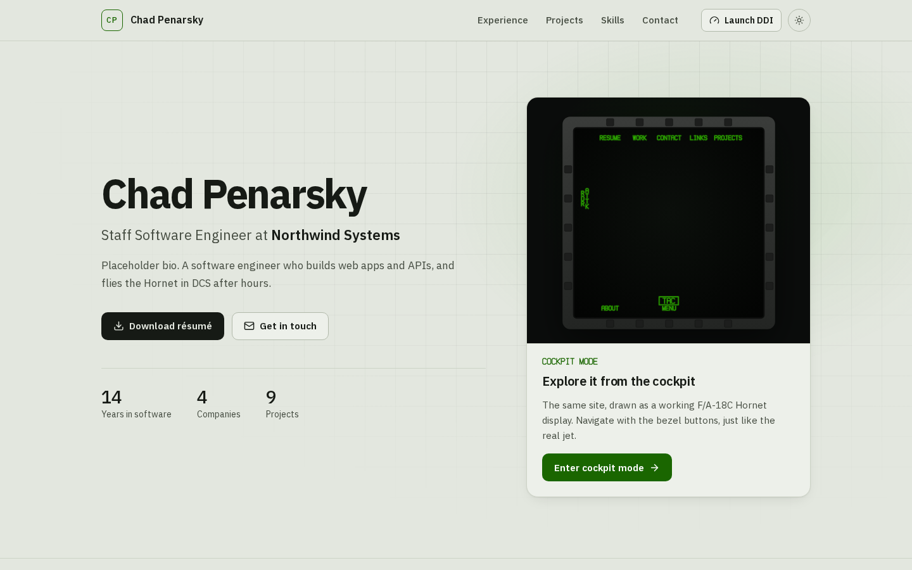
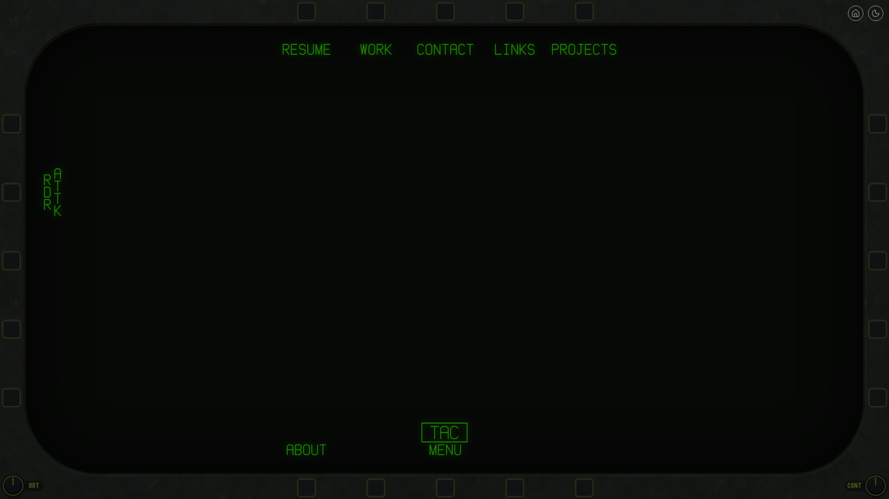
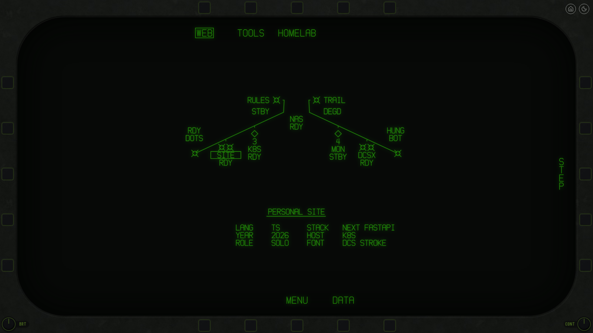

# personal-website

Chad's personal website, served at <https://chad.hambley.org>. It has two faces:

- **A professional homepage** with experience, projects, skills and contact details.
- **Cockpit mode:** the same site drawn as a working F/A-18C Hornet DDI (digital display indicator), modelled on the
  DCS World module. You navigate with the bezel buttons, as in the jet.







## Stack

Next.js (App Router, TypeScript, Tailwind v4) in front of a FastAPI + SQLite API. Content is edited in `/admin`.
Local dev runs in kind via Tilt, and production runs on a home k3s server.

```bash
make bootstrap   # system deps + Python packages
make tilt-up     # local cluster at http://localhost:3000
make validate    # lint, typecheck and tests
```

- [`docs/development.md`](docs/development.md): local setup, architecture, admin password, backups.
- [`docs/design.md`](docs/design.md): the DDI design and the API.

## Credits

The DDI stroke font and symbols are derived from Eagle Dynamics' DCS World F/A-18C assets. The bezel materials
come from CC0 textures by [ambientCG](https://ambientcg.com). This is a fan project, not affiliated with Eagle
Dynamics.
