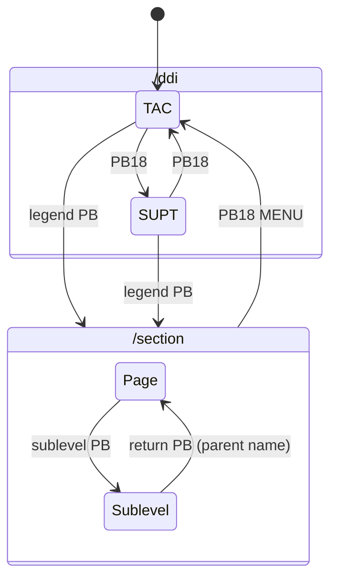

# Design: the F/A-18C DDI site

Status: draft for review. Date: 2026-10-02. Owner: Chad.

The site is one F/A-18C DDI that fills the browser viewport, drawn to match the DCS World module. Visitors
navigate only with the 20 bezel OSBs and the two bezel knobs. Every site section is a real URL that is
server-rendered as static SVG; state inside a section, such as TAC versus SUPT, is local and has no URL (ours). A hidden semantic HTML copy of each page serves crawlers and screen readers.
Each site section is drawn in the real DDI format that fits it best. Showcase pages (radar, home-server
stats) keep their real formats and legends.

Citations use these short names for the files in `docs/research/`:

| Tag | File | Precedence |
|---|---|---|
| [fnd] | `dcs-lua-foundations.md` | 1 (DCS Lua) |
| [pgA] | `dcs-lua-pages-a.md` | 1 |
| [pgB] | `dcs-lua-pages-b.md` | 1 |
| [bzl] | `dcs-bezel.md` | 1 |
| [gsys], [gpg] | `guide-ddi-system.md`, `guide-ddi-pages.md` | 2 (Early Access Guide) |
| [hog], [hdisp], [web] | `hoggit-wiki.md`, `hornet-display.md`, `web-recreation.md` | 3 |

Values marked **(ours)** are our own design choices. Everything else comes from the cited file.

---

## 1. Problem

The repo has a scaffold with a placeholder page. We need a design that a developer can build without
re-reading the research: the frame geometry, the controls, the rendering model, the font pipeline, the page
formats and the navigation. It must also cover SEO, accessibility and a phased plan.

## 2. Goals and non-goals

Goals:

- One DDI fills the viewport. Its geometry is never stretched.
- Symbology, legends, font, colour and stroke model match DCS. Nothing is invented where a DCS reference exists.
- The bezel controls behave as DCS models them: momentary OSBs and BRT and CONT knobs. The OFF/NIGHT/DAY
  selector is left out (ours, section 5.2).
- A day and a night appearance for the whole site, following the OS by default (ours, section 4.8).
- Every section has its own URL. Content is server-rendered and readable without JavaScript.
- Content is typed, edited in `/admin` and stored by the API (section 13).
- Static pages ship no per-frame work. Only the radar page animates.

Non-goals:

- The AMPCD, a second DDI, the HUD, and cockpit surroundings.
- Cautions and advisories as a system. We use their screen slots only where a page needs one.
- Sound. DCS audio is encrypted and cannot be extracted [bzl §1].
- Scanlines, flicker, phosphor persistence, warm-up, power-off fade, distortion and noise. DCS models none of
  them [fnd §4.4].
- A mobile-specific layout. Mobile only needs to work.
- A contact form and live server stats. The API serves content and admin routes only (section 13).

## 3. Resolved research conflicts

| Topic | Conflict | Decision |
|---|---|---|
| Side legends | [gsys] says the letters are rotated 90°. | Upright letters, one per line [fnd §5.3]. |
| Green | [hog] estimates `#5EE020`. [web] measures `#6CD214`. | `#1E8C00` [fnd §2.1]. [hdisp] measured the same value in a DCS screenshot. |
| Screen black | [web] `#0A1B13`. [hog] `#0A140C`. [bzl] `#1b2319`/`#161714`. [fnd §0, §4.2]: `#1a2218` centre, `#151915` edge. | (ours) Near-black with a trace of green: `#0a0d0a` centre, `#050605` edge by day; `#070907`/`#030403` at night (section 6.1). The DCS tint read as grey-green on a monitor. |
| OSB timing | [bzl §7] suggests firing on press. | Fire on press, as DCS does (Chad's decision). |
| Font | [hdisp] and [web] recommend the Hornet Display web font. | DCS `stroke_font.svg` glyphs (Chad's decision). One web font cannot match the per-size inter-character gaps [fnd §3.3]. |
| OSB caps | [bzl] says blank dark caps (`#282829`). DCS screenshots in [gsys]/[hog] show grey caps with a white index line, and ribs between buttons. | Blank dark caps per [bzl] (Chad's decision). |
| MENU from a page | [gsys] guesses "the last menu". [gsys] p120 and [hog] say TAC. | MENU from any page opens TAC. Lua is silent: the state machine is C++ [fnd §7]. |
| MENU legend | [gsys] reads the boxed page name and the number as one legend. | The title box at (0, −446) and the PB18 legend are separate elements [fnd §5.5]. |
| TAC PB10 | [gsys] reads "IMRV DSPLY". | `IMAV`/`MAV` over `DSPLY` [fnd §6.1]. |
| Glow | [web] suggests an `feGaussianBlur` glow of 0.6–1.2 units. | A two-stroke soft edge derived from thickness 0.8 and fuzziness 0.5 [fnd §4.1]. Bloom is off by day and on in the night theme (ours, section 6.3). |

---

## 4. Frame and layout

### 4.1 Units and the one scale

- All screen geometry is in DCS display increments (DI). 1 DI = 0.0048 in. The origin is the screen centre,
  +x is right and +y is up [fnd §1.1].
- SVG is y-down. The primitives convert with `svgY = −dcsY`, so page code uses DCS coordinates exactly as
  the Lua writes them.
- One CSS length, `--k`, is the number of pixels per DI. The frame uses it for every size, including the bezel,
  so the layout scales uniformly and is never stretched.
- The glass's short side is always 1089.6 DI (±544.8, the MDI mask [fnd §1.2]). The long side takes the
  rest of the viewport.

```css
.ddi-frame {
  /* 1089.6 glass + 2 × 64 bands, on both axes */
  --k: min(calc(100vw / 1217.6), calc(100dvh / 1217.6));
}
```

The frame is a full-viewport element with `overflow: hidden`. The page never scrolls.

### 4.2 Bezel band and screen geometry

| Constant | Value (DI) | Source / reason |
|---|---|---|
| `GLASS_SHORT` | 1089.6 | MDI mask ±544.8 [fnd §1.2] |
| `SYMBOLOGY_HALF` | 512 | drawable square [fnd §0] |
| `SCREEN_RADIUS` | 174 | MDI corner radius [fnd §1.2] |
| `BAND` | 64, on all four edges | (ours) was 104 at the sides and bottom and 180 at the top, which held the selector strip. Now 7 + 42 + 7 + 8: outer margin, cap, gap, lip ring. "Slim": the real side border is 22.5 mm ≈ 185 DI [bzl §3]. |
| `OSB_CAP` | 42, corner radius 6 | (ours) was 80. The cap:pitch ratio is 0.25; the real ratio is 0.56 and the radius is 14 % of the side [bzl §3]. |
| `OSB_LIP_GAP` | 7 | (ours) the clear gap between a cap and the lip ring. A cap is centred between the viewport edge and the ring, (64 − 8) / 2 = 28 DI from the edge. It was about 1 DI. |
| `LIP_RING` | 8 wide | recessed ring around the glass [bzl §3]. Colour per theme (section 4.8). |
| `KNOB_DIA` (BRT, CONT) | 50 | (ours) was 84. Sized to the 64 × 64 corner cell, centred 32 DI from both edges. |
| `EDGE_STRIP_DEPTH` | 260 | (ours) holds the deepest edge-attached element, the BIT group rule (x −503 to −303) [pgB §3] |

The screen box sits `64·k` inside every edge. It has `border-radius: calc(174 * var(--k))`. Examples:

| Viewport | k (px/DI) | Screen (px) | ±512 drawable area (px) | OSB cap (px) | Cap-to-lip gap (px) |
|---|---|---|---|---|---|
| 1920 × 1080 | 0.887 | 1806 × 967 | 908 | 37 | 6.2 |
| 2560 × 1440 | 1.183 | 2409 × 1289 | 1211 | 50 | 8.3 |
| 390 × 844 (phone) | 0.320 | 349 × 803 | 328 | 13.5 | 2.2 |

### 4.3 Screen regions

The screen holds up to three SVG regions. All are server-rendered and positioned with CSS only, so no
JavaScript measures the layout and nothing flashes on hydration.

| Region | CSS box | `viewBox` (DI, y-down) | Holds |
|---|---|---|---|
| **Symbology square** | `1089.6k` square, centred in the screen | `-544.8 -544.8 1089.6 1089.6` | Page symbology and tables. Pages draw inside ±512. |
| **Edge strips** (4) | left/right: `260k × 1089.6k`, flush with the screen edge, centred vertically. Top/bottom: `1089.6k × 260k`, flush, centred horizontally. | left `-544.8 -544.8 260 1089.6`; right `284.8 -544.8 260 1089.6`; top `-544.8 -544.8 1089.6 260`; bottom `-544.8 284.8 1089.6 260` | OSB legends and anything the Lua places relative to a PB position. |
| **Prose layer** (text pages only) | Square tier: same box as the square. Wide tier: `1536k` wide. | `-512 -544.8 1024 1089.6` or `-768 -544.8 1536 1089.6` | Wrapped running text. |

- **Edge strips use DCS coordinates unchanged.** A left-column legend at x = −500 is 44.8 DI inside the
  screen's left edge, as in DCS. On a square screen the strips lie exactly on the square's borders, so the
  render is identical to DCS. On a wide screen the side strips follow the screen edges, and the legends stay
  next to their buttons.
- Edge-attached content: OSB legends, legend boxes, BIT group blocks, OSB arrows, the HSI waypoint number
  at (505, 60), FPAS `HOME`, and the TAC/SUPT title box at (0, −446). A page puts everything else in the
  symbology square.
- **Prose tiers.** `@media (min-aspect-ratio: 1648/1000)` switches to the wide tier. At that aspect the
  screen is at least 1536 + 2 × 260 DI wide, so prose never overlaps a side strip. 16:9 gets the wide tier.
  16:10, 4:3 and portrait get the square tier. Both variants are pre-wrapped on the server and CSS shows one.
  Pagination always uses the square tier's row budget, so a page state shows the same content at every size. Wide
  screens just wrap less.

### 4.4 OSB placement

PB anchors come from `MPD_PB_defs.lua` [fnd §5.2]:

| PBs | Edge | Along-edge coordinate (DI) | Order |
|---|---|---|---|
| 1–5 | left | y = 307 − 167·(5 − n): −361, −194, −27, 140, 307 | bottom to top |
| 6–10 | top | x = −336 + 169·(n − 6): −336, −167, 2, 171, 340 | left to right |
| 11–15 | right | y = 307 − 167·(n − 11) | top to bottom |
| 16–20 | bottom | x = −336 + 169·(20 − n) | right to left (PB18 is bottom centre) |

- **Along an edge**, a button sits at its PB anchor, measured from the screen centre at the fixed DCS pitch.
  It does not spread out on long edges. The legend centre and the button centre therefore always line up. The
  DCS offsets (+2 DI on rows, −27 DI on columns) are kept: they match the physical buttons [bzl §1].
- **Across an edge**, a button is centred between the viewport edge and the lip ring, 28 DI from the edge
  (ours). It clears the ring by 7 DI.
- On a wide viewport the top and bottom rows cluster over the symbology square, and the side columns sit at
  the viewport edges. This keeps a row legend over the symbology it labels (for example STORES weapon names).
  Spreading the rows would break that.
- **Legend placement** follows `add_PB_label` exactly [fnd §5.3]:
  - Font: 120 % (14 × 24 DI, inter-character 6).
  - Rows: `CenterTop` at y = +500 or `CenterBottom` at y = −500. Each extra line is 35 DI further inward.
  - Columns: upright letters one per line, 30 DI pitch, centred on the PB y. The left column is `LeftCenter`
    at x = −500 and the right column is `RightCenter` at x = +500. Each extra word is a new column 25 DI
    inward.
  - Boxes: horizontal `22n × 36`, vertical `26 × 32n`, offset 6 DI outward. They use the same stroke [fnd §5.4].
- **Controls.** BRT is centred 32 DI from the viewport's left and bottom edges. CONT mirrors it on the right.
  Each knob has a placard (a collar plus a rounded tab 46 × 22 DI, white condensed caps 12 DI high; ours, was
  72 × 32 and 18) that points inward along the bottom band: "BRT" to the right of its knob and "CONT" to the
  left of its knob [bzl §3].

### 4.5 Bezel appearance

The bezel is drawn from baked, lit images (ours), not CSS gradients. `scripts/materials/` bakes them from CC0
ambientCG textures (README, "Bezel materials") into `src/frontend/public/materials/`. DCS was only a visual
reference. The colours below are the day values the bakes are matched to, in linear light, on flat unshadowed parts.

| Element | Value | Source |
|---|---|---|
| Face | `#2F302F` satin paint over powder-coat grain, with light chips, scratches and grime, plus a faint top light | [bzl §3] (texture ours) |
| OSB cap | `#282829`, blank, raised in a shallow well with a polished bevel. Pressed: `#222223`, 1.8 DI deeper, no transition. | [bzl §3, §1] (the pressed values are ours) |
| Knobs | `#222427`, fluted grip, knurled shoulder, a white ring on the skirt and a white index line | [bzl §3] |
| Placards | `#1C1D1D`, near-black as in DCS, with white upper-case text in a condensed sans (Barlow Condensed 500, OFL, through `next/font`) | [bzl §3] (font ours) |
| Screws | none (ours: they would only clutter a slim band) | |

**Light (ours).** Every bake shares one key light from the top left and above, plus a sky fill, so the parts agree.
The night bakes use a weaker, cooler key with almost no specular, and every colour drops by the face's ratio
(face `#141615`). A theme swaps the whole image set; night is not the day set dimmed.

**Assets (ours).** Each part ships as AVIF, with WebP as a fallback. Parts come at `@2x` (2 px per DI) and `@3x`
(3 px per DI). CSS `image-set()` offers them as 1x and 2x, so any DPR above 1 takes `@3x`.

| Asset | Size | Drawn as |
|---|---|---|
| `bezel-tile-{theme}` | 1024 px, seamless | The face background, tiled at `calc(689 * var(--k))`, so the paint keeps one physical scale at every viewport size |
| `lip-9slice-{theme}` | 380 DI box | The lip ring's `border-image`: light and shade only, so the face tile shows through. The 182 DI corner slice (47.89 %) is drawn 182 DI wide, so it follows the screen radius plus the lip |
| `osb-up-{theme}`, `osb-down-{theme}` | `OSB_ART` = 48 DI | The OSB's `::before`, cap and well together. The pressed image replaces the 2 DI translate: moving the cap would move its well too |
| `knob-base`, `-body`, `-light`-`{theme}` | `KNOB_ART` = 4/3 of the knob | Static cast shadow; the knurled body, which turns with `--knob-angle`; static key light. The body is lit along the view axis, so its shading does not depend on the angle |
| `knob-index-mask`, `knob-ring-mask` | `KNOB_ART` | Masks tinted with `--knob-ink`. The index turns with the body; the ring is static |
| `osb-glow-mask` | `OSB_ART` | Night only: where panel light leaks from the gap round each cap |

**Night panel lighting (ours).** The OSB gaps, the knob ring and index, and the placard caps are lit in NVG green
`#45611d`, a slightly yellow green set well below the symbology's `#1E8C00`, so the display stays the brightest
thing in view. It reads as a soft edge-lit glow: the ring, index and caps sit above the key-light layer with a
half-strength 1.6 DI halo, and the OSB glow mask adds at opacity 0.4 (`plus-lighter`). By day the ring, index and
caps are white paint under the key light. The placard is `#0C0D0D` at night.

**Loading (ours).** A visitor fetches one format at one density for one theme. A first paint is 39–49 KB of AVIF:
day is 42 KB at `@2x` and 49 KB at `@3x`, night 39 KB at `@3x`. The pre-paint script preloads the resolved theme's
first-paint files. A hidden layer loads the pressed OSB image after first paint. A theme switch decodes the new set before it flips `data-theme`, waiting at most 400 ms, so the bezel
never flashes bare. Every material box is sized in DI, so nothing shifts when an image arrives.

### 4.6 Swappable frame

The frame is one component behind one interface. Pages never know which frame renders them.

```ts
// src/frontend/src/ddi/frame/types.ts
export interface DdiScreen {
  legends: readonly LegendSpec[];          // what each OSB shows and does (section 9)
  symbology: React.ReactNode;              // DCS coordinates, drawn in the square
  edges?: Partial<Record<Edge, React.ReactNode>>; // DCS coordinates, PB-anchored content
  prose?: { square: React.ReactNode; wide: React.ReactNode };
}
// (ours) One screen per in-section state, for example { TAC, SUPT } on `/ddi` (section 9.4)
export interface DdiScreens { initial: string; screens: Readonly<Record<string, DdiScreen>> }
export type DdiFrame = (props: { screens: DdiScreens }) => React.ReactNode;
```

The frame server-renders every state's screen and OSBs. A small client provider holds the current state and
shows that state's nodes, so switching state re-renders no SVG on the server and changes no URL. The state
starts at `initial` each time the page mounts.

`FullViewportFrame` is the frame we ship. A later `BezelSquareFrame` would place the same four strips on the
square's own borders, which is exactly DCS. The root layout picks the frame with one import.

### 4.7 Mobile

Mobile reuses the same frame. On a phone in portrait the width sets `k` (about 0.32). The square sits in the
middle of a tall screen. The top and bottom strips follow the screen's top and bottom edges. OSB caps are
about 13.5 px. That is under 24 px, but WCAG 2.2 target size (2.5.8) passes through its spacing exception: the
OSB pitch is 167 DI, about 53 px, so 24 px circles round the caps never meet (ours). Text is too small to
read at 100 % (about 6 px). A visually hidden "Text view" skip link is the first focusable element and opens
the plain view (section 10.2). Open question 5 asks whether to make it visible.

### 4.8 Day and night appearance (ours)

The whole site has two themes, `day` and `night`. They replace the cockpit's OFF/NIGHT/DAY selector as the way
to dim the scene.

- **Default.** The theme follows the OS `prefers-color-scheme`: `dark` gives night. It tracks OS changes live
  while there is no override.
- **Override.** A small icon button sits in the viewport's top-right corner, centred in the bezel's corner cell
  and at least 4 px from the edges. It is outside the DDI concept: 28 px, no background, a 1 px circular border.
  It shows the current theme: a sun by day and a moon at night. It is a real `<button>` named "Night mode" with
  `aria-pressed`, inside an `<aside aria-label="Appearance">`, and last in the tab order.
- **Persistence.** A press stores the new theme in `localStorage["site:theme:v1"]` as `"day"` or `"night"`.
  The value is untrusted input: anything else means no override. The pre-paint script (section 5.5) resolves
  the theme and sets `data-theme` on `<html>` before first paint, and CSS picks the icon from that attribute,
  so a reload never flashes. Without JavaScript there is no attribute and the day tokens apply.
- **Tokens.** `src/theme/theme.css` holds one block per theme (`:root[data-theme="day"]`,
  `:root[data-theme="night"]`), split into groups: bezel (`--bezel-face`, `--bezel-sheen`, `--bezel-tile`), lip
  ring (`--lip-light`), OSB (`--osb-up`, `--osb-down`), knob and placard (`--knob-*`, `--placard*`), night panel
  lighting (`--panel-*`), screen (`--screen-*`), emissive (`--ddi-bloom-*`), toggle and focus
  (`--theme-toggle-ink`, `--focus-ring`) and plain view (`--plain-*`). The bezel, lip, OSB and knob tokens point
  at the baked images of section 4.5; each theme has its own set. A later theme change edits one group.
- **Toggle contrast.** The ink is a light neutral on each bezel, not a black/white flip: `#d0d2d0` on the day
  face `#2f302f` (8.7:1) and a mid grey `#8f9290` on the night face `#141615` (5.8:1), so it does not
  glare in a dark room. In plain view it uses `--plain-toggle-ink`.

| Token group | Day | Night |
|---|---|---|
| Bezel face (tile mean) | `#2f302f`, `bezel-tile-day` | `#141615`, `bezel-tile-night` |
| Lip ring, OSB caps, knobs | `*-day` bakes | `*-night` bakes |
| Knob ring and index ink | `#e2e3e0` | panel light `#45611d` |
| Placard / ink | `#1c1d1d` / `#e6e7e4` | `#0c0d0d` / panel light `#45611d` |
| Panel lighting / halo | off | `#45611d` / `rgb(69 97 29 / 0.5)` |
| Screen centre / edge | `#0a0d0a` / `#050605` | `#070907` / `#030403` |
| Symbology halo | DCS falloff (section 6.2) | the same: night does not widen it |
| Bloom | off | on at opacity 0.3 (section 6.3) |
| Plain view background / text | `#f5f6f4` / `#1c1f1c` | `#0f120f` / `#dfe5db` |

---

## 5. Bezel controls

All controls are real `<a>` or `<button>` elements in the bezel, except BRT and CONT, which are sliders. Clicks on the glass do nothing.
The bezel has no OFF/NIGHT/DAY selector (section 5.2).

### 5.1 OSBs

- DCS behaviour: momentary. The arg goes to 1 while held and returns to 0 on release. The press is not
  animated: the cap jumps straight to the pressed position [bzl §1].
- The pressed look comes from CSS `:active`, so the look needs no JavaScript.
- The action fires on press, as in DCS (Chad's decision). A small client handler on the OSB runs the action
  on the primary-button `pointerdown` and on `keydown` for Enter and Space. It then suppresses the `click` that
  follows, so the action never fires twice. There is no drag-off cancel, matching DCS.
- Without JavaScript the native `click` still works, so links remain crawlable and usable before hydration.
- Navigation OSBs are `<a href>` elements (Next `<Link>`, and the press handler calls `router.push`), so
  crawlers follow them. Downloads are `<a download>`. Page actions are `<button>` elements.
- A blank OSB is a `<button tabindex="-1" aria-hidden="true">` with no action. It still shows the press, as a
  blank OSB does in DCS.
- An inert legend on a showcase page is a `<button aria-disabled="true">` and is left out of the tab order.
- Accessible name: the legend's `label` from the registry, for example "Projects" or "Radar, simulated".
- A state OSB (ours) switches the page's in-section state, for example PB18 on the menu. It is a `<button>`
  that fires on press like the others, and also on a plain `click`, since it has no native action. The plain
  view hides it (section 10.2).

### 5.2 No OFF/NIGHT/DAY selector (ours)

The DCS bezel has a 3-detent OFF/NIGHT/DAY selector above PB8 [bzl §3]. We removed it, with its strip in the
top band, so the top band is as slim as the others. NIGHT drew the symbology at ×0.126 [fnd §2.2], which is
almost invisible on a monitor, and OFF only hid it. The site-wide night theme (section 4.8) replaces both.

### 5.3 BRT

- Continuous from 0 to 1. Default 0.5, with the pointer at 12 o'clock. It was 1.0 before the curve was retuned.
- Each knob is one `role="slider"` element with `aria-valuenow` and `aria-valuetext` as a percentage (`"50%"`).
  It replaced the two half-buttons.
- Steps of 0.1 (DCS gain 0.1) [bzl §1]: a click on the left half steps down and on the right half steps up; the
  wheel steps once per 50 px of accumulated `deltaY`, so trackpads behave; the arrow keys step too. Home and End
  go to 0 and 1.
- **Drag (ours).** Press and drag sideways. Dragging right turns the knob clockwise (up) and dragging left turns
  it counter-clockwise (down). The change follows the horizontal pointer travel since the last move, not the
  pointer's position or angle: 250 CSS px sweeps 0 to 1, whatever the knob's size. The value clamps at the end
  stops and never wraps. Travel past an end stop is dropped, so reversing moves the knob at once. A press must
  move 4 px before it becomes a drag; less is a click. The knob captures the pointer, sets `touch-action: none`
  and `user-select: none`, and shows a `grab` cursor (`grabbing` while dragging).
- **Centre detent (ours).** A drag keeps an unsnapped value that accumulates the pointer travel. While that value
  is within 0.04 of 0.5, the knob commits exactly 0.5; outside the window it commits the unsnapped value. A drag
  must travel through the window (10 px each side) to leave it, which feels like a notch. Clicks, the wheel and
  the keys already land on exact tenths, so the detent does not apply to them.
- The pointer sweeps 300° (ours): −150° (about 7 o'clock) at 0, 0° (12 o'clock) at 0.5 and +150° (about
  5 o'clock) at 1, clockwise from up. The 60° at the bottom is a dead zone the pointer never enters.
- **Curve (ours):**
  - At and below 0.5: `f(b) = 0.05 + 0.95 · 2b`, and `gain = f`. So f(0.5) = 1: the default draws
    the material green at unit gain, the look DCS shows by default [fnd §2.1]. The DCS curve itself is C++
    [fnd §2.2].
  - The ramp is a straight line. Chrome composites `opacity` on sRGB-encoded values, not in linear light: we
    measured opacity 0.5 of `#1E8C00` over black at G = 70, not 102. Encoded values are close to perceptual, so
    a straight line dims in even-looking steps. The old `b^2.2` exponent made the bottom half far too dark.
  - The 0.05 floor keeps the symbology faintly visible at BRT 0.
  - Above 0.5 the gain stays at 1. Opacity cannot exceed 1, and an additive layer of `#1E8C00` cannot draw
    brighter than `#1E8C00`. A `brightness()` filter could, but it would draw a colour that is not the material.
    Instead BRT lights more of each stroke's falloff,
    the way an overdriven display blooms: `halo = h + (1 − h) · 0.5 · (2b − 1)`, where `h` is the CONT halo
    (section 5.4). The cap is BRT 1, where the halo has closed half its gap to opaque: 0.75 at CONT 0.5.

### 5.4 CONT (our design)

DCS defines no CONT behaviour [fnd §2.2]. We make CONT set the sharpness of the stroke edge, which is the
contrast between a stroke and the background around it. It never changes the black level, as [fnd §2.2]
recommends.

- Range 0 to 1, continuous. Default 0.5, with the pointer at 12 o'clock. Same inputs, sweep and drag as BRT.
- `h = 0.75 − 0.5 · c`, so it runs from 0.75 (soft) to 0.25 (crisp) and is 0.5 at the default. The default look
  is unchanged by the retune: at BRT and CONT 0.5 the halo opacity is 0.5, as before.
- The halo is the outer stroke described in section 6.2. Above BRT 0.5, BRT raises it (section 5.3).

### 5.5 Intensity and persistence

```
gain = f(BRT)
halo = h(CONT) + (1 − h(CONT)) · 0.5 · max(0, 2·BRT − 1)
```

- The theme does not change the gain. Night draws more glow instead (sections 4.8 and 6.3).
- State is stored per viewer in `localStorage["ddi:controls:v3"]` as `{"brt":0..1,"cont":0..1}`. The knob
  values are floats rounded to thousandths, so 0.1 steps never drift. v1 stored integer tenths and v2 also
  stored the selector's mode. The key changes with the format, so an older value is ignored and the controls
  start at the defaults.
- Stored state is untrusted input, not an internal invariant. A missing or invalid field reads as its default
  (0.5, 0.5). A knob value must be a finite number; one outside 0–1 is clamped.
- A small inline script in `<head>` runs before first paint. It reads the stored state and sets
  `--ddi-gain`, `--ddi-halo` and the pointer angles on `<html>`, so stored knobs never flash. It also resolves
  the theme and sets `data-theme` (section 4.8). The knobs are continuous, so the script repeats the parse and curve maths instead of looking
  values up; a unit test checks it against the app's code across the whole range. The same
  script reads `?view=plain` (section 10.2).
- The controls island reads the same values through `useSyncExternalStore`. The server snapshot is the
  default state, so hydration does not mismatch.

### 5.6 First-visit tutorial (ours)

A first-time visitor sees one screen that explains the bezel. It is not a multi-step tour.

- **Look.** A 60 % black layer dims the viewport. The OSBs and the knobs rise above it, so they stay lit. Corner
  brackets, like a HUD target box, mark six single controls: one OSB, PB18, BRT, CONT, the homepage link and the
  theme toggle. Each bracket is a square centred on its control that clears the control's visible edge by 3 DI: the
  OSB well (48 DI), the knob's placard collar (56 DI) or the 28 px corner button. Each callout is a short label in the
  placard font (Barlow Condensed caps) in a brighter cut of the symbology green, underlined by its leader line:

  | Control | Label | Leader |
  |---|---|---|
  | One OSB | Press the buttons to navigate | Along the band, then down midway to the next row position, between the legends |
  | PB18 | MENU switches TAC and SUPT | Along the band, then up midway to PB17, clear of the legends and the title box |
  | BRT, CONT | Brightness / Contrast, drag or scroll | 45° up and inward from each corner |
  | Homepage link | Standard homepage | 45° down and inward, below the top-row legends |
  | Theme toggle | Day / night | 45° down and inward, parallel to the homepage link's, one row lower |

  The marked OSB is the leftmost top-row OSB with a legend on TAC (PB6 `RESUME` today). `tutorial/highlight.ts`
  derives it from the registry, so it stays a live button when the menu changes. Its label sits one row below the
  theme toggle's, so the top labels never meet on a narrow viewport. It was the four OSB rows and columns, which put
  the brackets of one box a whole edge apart.

  A centred panel holds the dialog's name ("Quick start"), "Press any button to begin" and a "Got it" button.
- **Layout.** Every bracket and leader is DI × `--k` from the PB anchors and the bezel constants, the same as the
  frame. The corner buttons' brackets and callouts use their px placement from `theme/corner.ts`. Nothing is
  measured, so the callouts track the controls at every viewport size.
- **Closing.** It closes for good on the first press of a real control: any OSB, BRT or CONT, the theme toggle, the
  homepage link or "Got it". A press counts by primary pointer press, by the keys that work the control (Enter or
  Space on a focused button, an arrow key, Home or End on a focused knob) or by the wheel on a knob. Escape anywhere
  also closes it, as users expect of a dialog. A press on the glass, the dimmed backdrop or empty bezel does nothing,
  and so does any other key. It was any press anywhere, which closed it before a visitor had read it. The listeners
  only observe, so the press also does its normal job: an OSB still navigates and a knob still turns. The overlay
  takes no pointers except its panel.
- **Persistence.** The close stores `localStorage["ddi:tutorial:v1"] = "done"`. Only that exact value counts.
  Blocked storage reads as done, since a close could never persist and the overlay would return on every page.
  The pre-paint script sets `<html data-tutorial="open">` and CSS shows the overlay only then, so a returning
  visitor never sees it flash. The plain view never opens it.
- **Accessibility.** It is a `role="dialog"` with `aria-modal="false"`, named by its heading. Every control stays
  usable, so there is no focus trap and nothing is made inert. A live region would not fit: text present at load
  is not announced, and it cannot hold the close button. The dialog sits before the OSBs in the DOM, so "Got it"
  is the first stop after `<main>`. The callout text is a list; the brackets and leaders are hidden from assistive
  technology. It fades in over 450 ms, and not at all under `prefers-reduced-motion`.
- **Tests.** The Playwright config stores the flag for every spec. `e2e/tutorial.spec.ts` clears it to opt in.

---

## 6. Rendering

### 6.1 Layers, bottom to top

| Layer | What | Source |
|---|---|---|
| Screen tint | `var(--screen-tint)` fill with an inset vignette to `var(--screen-edge)` (`box-shadow: inset 0 0 calc(120 * var(--k)) calc(20 * var(--k))`). Day `#0a0d0a` → `#050605`, night `#070907` → `#030403`. It never changes with BRT or CONT. | (ours) near-black; DCS uses `#1a2218` → `#151915` [fnd §4.2] |
| Emissive layer | The square, the edge strips and the prose layer, in one container with `mix-blend-mode: plus-lighter` and `opacity: var(--ddi-gain)`. | [fnd §4.2]: additive bake |
| Bloom (optional) | See 6.3 | |
| Glass smudge (optional) | See 6.3 | |

- **Additive look.** `plus-lighter` adds the green to the tint, as the DCS bake does with
  `additive_alpha = true`. At BRT 0.5 or above a stroke core shows `#0a0d0a + #1E8C00 = #289908` by day. The
  darker base raises the contrast of the strokes and the halo; the default halo needed no retune.
  `@supports not (mix-blend-mode: plus-lighter)` falls back to `screen`, which looks almost the same on a dark
  base.
- Changing BRT changes only `opacity`. That is compositor-only work and causes no re-raster.
- Overlapping strokes inside the layer use normal alpha, not additive blending. That is a small deviation
  from DCS, and it avoids a blend per element.
- Colour: every stroke is `#1E8C00` [fnd §2.1]. No page we build needs red or yellow. If one does, use the
  commented reference values in `materials.lua`: red `{255,93,0}`, yellow `{255,225,0}` [fnd §2.1].
- `@media (forced-colors: active)`: strokes use `CanvasText`, and the blending and halo are switched off.

### 6.2 Stroke model

DCS draws every line, box, circle and glyph with one shader: thickness 0.8 (the solid core) and fuzziness
0.5 (the soft falloff). Both are constant: BRT and CONT do not change them [fnd §4.1, §4.5]. The
units are pixels of the C++ bake target. We convert them with one inferred reference: the DCS screenshot in
[hdisp] shows the 1089.6 DI glass at about 600 px. So 1 reference px = 1.816 DI.

| Quantity | DI | At k = 0.786 |
|---|---|---|
| Core width (0.8 ref px) | 1.45 | 1.14 px |
| Falloff each side (0.5 ref px) | 0.91 | 0.72 px |
| Halo width = core + falloff | 2.36 | 1.86 px |

The soft edge is two strokes of the same geometry and needs no filter:

```tsx
// EmissiveLayer: one DOM copy of the symbology, painted twice
<defs><g id={id}>{children}</g></defs>
<use href={`#${id}`} className="ddi-halo" />  {/* width = halo, opacity = var(--ddi-halo) (0.5 by default) */}
<use href={`#${id}`} className="ddi-core" />  {/* width = core, opacity 1 */}
```

```css
.ddi-core, .ddi-halo { fill: none; stroke: #1E8C00; stroke-linecap: round; stroke-linejoin: round;
                       vector-effect: non-scaling-stroke; }
.ddi-core { stroke-width: max(1px, calc(1.45 * var(--k))); }
.ddi-halo { stroke-width: calc(max(1px, calc(1.45 * var(--k))) + max(0.6px, calc(0.91 * var(--k))));
            opacity: var(--ddi-halo); }
```

- The core and the halo are the same in both themes: the halo is always the DCS falloff, 2.36 DI. Night does
  not widen it; the night glow comes only from the faint bloom (section 6.3). No filter touches the core or the
  halo, so the strokes stay crisp.

- The halo at half opacity, ending halfway along the falloff, approximates the shader's linear falloff.
- The primitives never set `stroke-width`, so the two `<use>` instances can style it.
- `non-scaling-stroke` plus `max(1px, …)` keeps a stroke at least 1 device pixel wide on a phone.
- There is no filter and no per-frame work. A static page is painted once.

### 6.3 Optional effects

Both effects are off by day.

- **Bloom (on in the night theme, ours).** This imitates DCS's engine-wide post-process bloom, which is not part
  of the module [fnd §4.3]. `EmissiveLayer` renders a third `<use>` behind the halo, 4 DI wide, filtered by one
  shared `feGaussianBlur` (`BLOOM_BLUR`, stdDeviation 8 DI). The theme tokens `--ddi-bloom-display` and
  `--ddi-bloom-opacity` hide it by day and show it at a faint opacity 0.3 at night; the emissive layer's opacity
  scales it with the gain. It is a wide, dim wash, not a wider halo, so the strokes keep their DCS edge. The
  filter sits on static groups, so it rasterizes only when the page changes. Animated symbology goes in a
  screen's `live` layer, an `EmissiveLayer` with `bloom={false}`: the radar's moving contacts never re-run the
  blur.
- **Glass smudge (`SMUDGE_ENABLED`, not built).** This is our own procedural texture, not ED's. Its alpha is at most
  40/255 with a mean near 7/255, and it is masked by a fixed top-left reflection gradient. It sits above the
  emissive layer with normal blending and does not change with any control. Smudges in DCS only show in
  reflections and never blur the symbology [fnd §4.2].

---

## 7. Stroke font and symbols

### 7.1 Build pipeline

- `scripts/extract_dcs_assets.py` is a uv script with no dependencies outside the standard library. It is a
  port of the research extractor [fnd §9]. Run it with `make dcs-assets`.
  - It reads `$DCS_ROOT/Mods/aircraft/FA-18C/Cockpit/IndicationResources/MDG/stroke_font.svg`,
    `stroke_symbols_MDI_AMPCD.svg` and `stroke_symbols_HUD.svg`.
  - The default is `DCS_ROOT ?= /mnt/f/Program Files/Eagle Dynamics/DCS World`.
- Steps:
  1. Apply the SVG transforms.
  2. Snap each glyph to its 20 × 30 DI authoring cell. The cell origin is
     (282.222 + 564.444·col, 348.889 + 846.667·row) in file units, and 28.222 file units = 1 DI [fnd §3.2].
  3. Keep the 55 characters that `fonts.lua` maps. Drop the unused `*-alt` ids.
  4. Convert each glyph to polylines and circles.
  5. Keep every symbol in its authored local coordinates. Symbols use `"FromSet"` anchoring, which is C++
     [pgB §14.6], so each symbol's anchor is checked against the research renders.
- It writes two files, which we commit:
  - `src/frontend/src/ddi/generated/strokeFont.ts`
  - `src/frontend/src/ddi/generated/strokeSymbols.ts`

  Each has a header with the source path, the source file's SHA-256 and "Generated. Do not edit."
- CI never runs the script, because it has no DCS install. Re-run it by hand only when DCS updates.
- Licensing: the glyphs and symbols are derived from Eagle Dynamics assets. Chad has accepted that risk. The
  README credits ED as the source.

```ts
// generated/strokeFont.ts (shape)
export type Stroke =
  | { kind: "poly"; pts: readonly number[] }          // x0,y0,x1,y1,… in DI, cell origin top-left, y down
  | { kind: "circle"; cx: number; cy: number; r: number };
export const STROKE_FONT: Readonly<Record<string, readonly Stroke[]>>; // 12 × 20 DI cell
```

### 7.2 Text layout (`StrokeText`)

Text layout follows the `stringdefs` model exactly [fnd §3.3]:

| Font id | Glyph W × H | Inter-character | Interline |
|---|---|---|---|
| `F100` | 12 × 20 | 4 | 5 |
| `F120` (also OSB legends) | 14 × 24 | 6 | 6 |
| `F150` | 18 × 30 | 6 | 12 |
| `F200` | 24 × 40 | 12 | 12 |
| `F120_WIDE`, `F150_WIDE`, `F150_X_WIDE` | 14 × 24, 18 × 30, 24 × 30 | 9 | 12 |
| `BIT` | 14 × 24 | 6 | 8 [pgB §0] |

- Line width = n·W + (n − 1)·ic. Line pitch = H + il. The 9-way alignment (`LeftCenter`, `CenterTop`, …)
  aligns the text's bounding box to `pos`.
- Glyphs scale non-uniformly from the 12 × 20 cell: sx = W/12 and sy = H/20. Circles become arcs with
  rx = r·sx and ry = r·sy.
- A space advances one cell and draws nothing. Text is upper-cased first, because DCS has no lower case.
  `\n` starts a new line.
- Each string becomes one `<path>`, which keeps the DOM small.
- An unmapped character throws at render time. Because pages render at build time, the build fails. Content
  tests catch this first (section 13).

### 7.3 Missing characters

The DCS set has no `@ & ! ; < > [ ] |` and no lower case [fnd §3.2]. Arrows are symbols. No DCS reference
exists for these characters, so we may add the few that content needs.

- They live in `src/frontend/src/ddi/font/extraGlyphs.ts`, marked as ours.
- They use the same 12 × 20 grid and 3 DI chamfers.
- The first need is `@`, for the contact email.

---

## 8. Component and module architecture

```
src/frontend/src/
  app/                         # routes only: one page.tsx per URL, plus sitemap.ts and robots.ts
    (home)/                    # (ours) / : the standard homepage's root layout, page and share image (section 10.3)
    (ddi)/                     # (ours) /ddi and every DDI page
      layout.tsx               # frame choice, the pre-paint script, fonts, metadata base, the corner buttons
  home/                        # (ours) the standard homepage: sections, model.ts (derived from content/), home.css
  ddi/
    constants.ts               # every constant in this doc, with its citation
    geometry.ts                # toSvg, pbAnchor, lineEnd, align, measure
    generated/                 # strokeFont.ts, strokeSymbols.ts (committed)
    font/extraGlyphs.ts
    primitives/                # server components (see table)
    frame/                     # FullViewportFrame, Osb, screenState (in-section state), types.ts
    controls/                  # client island: Knob, useDisplayControls, useKnobDrag, prepaint.ts
    formats/                   # real DCS layouts, parameterised by content (one file per format)
    pages/                     # registry.ts and one module per page: content + format + legends
  content/                     # typed data (section 11)
  semantic/                    # SemanticPage and the per-page semantic components
  theme/                       # day/night: theme.ts, store.ts, ThemeToggle, theme.css (section 4.8)
```

**Primitives.** These are server components that mirror the DCS helpers in `symbology_defs.lua` and
`MPD_page_defs.lua` [pgA §0, pgB §0].

| Primitive | DCS helper | Behaviour |
|---|---|---|
| `StrokeLine` `{len, pos, rot}` | `addStrokeLine` | From `pos` to `pos + len·(−sin rot, cos rot)`. `rot` is in degrees counter-clockwise from up. |
| `StrokeBox` `{w, h, align, pos}` | `addStrokeBox` | 4-edge rectangle. |
| `StrokeCircle`, `StrokeArc` | `addStrokeCircle`, `addStrokeArc` | Arc points are at (r·sin a, r·cos a), with a clockwise from up. |
| `StrokeText` `{text, font, align, pos}` | `addStrokeText` | Section 7.2. |
| `Symbol` `{id, pos, rot, scale}` | `addStrokeSymbol` | A generated symbol path. |
| `XOver` `{w, h, pos}` | `add_X_Over` | Two diagonals. |
| `PBLabel` `{pb, lines, boxed}` | `add_PB_label` | Section 4.4. Rendered into its edge's strip. |
| `MenuTitle` `{name, boxed}` | `addMenuLabel` | 150 % at (0, −446) in a 110 × 46 box [fnd §5.5]. Rendered into the bottom strip. |
| `EmissiveLayer` | (bake) | The halo/core pair (section 6.2). |

- **Formats** transcribe one DCS page each, such as `formats/bitList.tsx` or `formats/storesWingform.tsx`.
  They hold the Lua constants with citations and take content as props. They never import from `content/`.
- **Pages** bind content to a format. Each returns a `DdiScreen` (section 4.6) and a semantic component.
- **Client components**, and only these:
  - the controls island and the theme toggle;
  - the screen-state provider, which shows the current in-section state's server-rendered nodes;
  - the page islands that own transient state: the Links keypad selection, the Contact COPY action, and the
    radar animation.

  Everything else is a React Server Component and is statically generated.

---

## 9. Pages and navigation

### 9.1 Section to format mapping

**Section pages** draw our content in a real format's layout. **Showcase pages** are real formats shown as
themselves, with fake data. A section's menu legend is the section name. Where the host format's real menu
legend is on TAC, the section takes that OSB.

| Section | Format | Why this format | URL | Menu legend |
|---|---|---|---|---|
| About | TGT DATA OWNSHIP [pgB §11] | It is a profile card: label/value rows, a 5-row list and IFF lines. None of its values has a controller, so every slot is free content. The bottom-left quadrant is empty in DCS and holds the bio. | `/about` | TAC PB20 `ABOUT` (TGT DATA's position) |
| Resume | S/W CONFIGURATION [pgB §3] | A 2 × 12 name/value table suits skills and qualifications. Its only action OSB, PB20 (`OVRD`), becomes the PDF download. | `/resume` | TAC PB6 `RESUME` |
| Work history | BIT FAILURES plus sublevels [pgB §3] | It has eight OSB-anchored group blocks (label, rule, status) that lead to sublevels. These become employers. The 17-row name/status list becomes the role timeline. `PAGE` (PB16) is a real pager. | `/work` (employer sublevels and pages are in-section state, ours) | TAC PB7 `WORK` |
| Projects | STORES [pgA §1] | The exact wingform with 9 stations. Each station is a project. The top row (PB6–10) is a category tab bar that boxes the selection. `STEP` (PB13) cycles stations. `DATA` (PB17) opens the description. | `/projects` (the selected station and DATA are in-section state, ours) | TAC PB10 `PROJECTS` (ours: STORES' PB5 collides with the stacked `RDR`/`ATTK` legend at PB4) |
| Contact | MIDS [pgB §6] | Label/value rows with colon alignment, and an empty cautions slot for feedback. Its `XMIT` OSB becomes "send mail". | `/contact` | TAC PB8 `CONTACT` |
| Links | UFC BU [pgB §12] | A 12-row channel table with a selection box. The keypad digits on the OSBs select a row. `ENT` opens it. | `/links` | TAC PB9 `LINKS` |
| Radar (showcase) | RDR ATTK, RWS [hog §4], [gpg §16] | The real format, with fake moving contacts. | `/radar` | TAC PB4 `RDR`/`ATTK` (real) |
| Home server (showcase) | ENG [pgA §2] | A 13-row, two-column metrics table: two hosts and 13 fake metrics. | `/server` | SUPT PB12 `ENG` (real) |
| Mission initialization (showcase) | MUMI [pgB §5] | The real format with the site's deployment as mission data. Its `ID` load opens `/admin` (`docs/pages/mumi.md`). Noindexed. | `/mumi` | SUPT PB10 `MUMI` (real) |
| Later showcases | SA [pgB §10], EW [pgB §7], HSI [pgB §9], AZ/EL | Real formats. EW's BIT pages already contain "THE QUICK BROWN FOXES…" [pgB §7]. | `/sa`, `/ew`, `/hsi`, `/azel` | TAC PB13, TAC PB17, SUPT PB2, TAC PB1 (all real) |

Rejected candidates: CHKLST has no OSB legends, so it cannot host a download or paging. FUEL and FCS are
graphic metaphors for proficiency, which section content does not need. MUMI is a weaker fit for Resume than
S/W CONFIG, which has 24 rows. HSI DATA WYPT fits too few characters per row for job bullets.

### 9.2 Legends on our pages

- **Showcase pages draw every real legend at its real position.** Cheap ones work locally, for example the
  radar's scan controls, TWS and DATA sublevel (`docs/pages/radar.md`). The rest are inert (section 5.1).
- **Section pages draw only legends that do something.** A legend uses the real wording and position when a
  real legend has the same role:
  - paging is `PAGE` at PB16 (BIT);
  - stepping is `STEP` at PB13 (STORES);
  - selecting is a digit at PB8–17 (UFC BU);
  - a sublevel's return legend is the parent's name at the format's return OSB (BIT sublevel PB8, HSI DATA
    PB10). The parent's name is the DCS convention: `HSI` returns from HSI DATA and `BIT` returns from S/W
    CONFIG.
- **Boxing** follows DCS [fnd §5.4, gsys §2.2]. A legend is boxed when it marks the current choice: the menu
  title, the selected STORES category, `DATA` while the data sublevel is open, the selected role on a work
  sublevel, and `RECORD` on ENG (always boxed in DCS). Menu legends are never boxed, because pressing one
  leaves the menu.
- `MENU` is the PB18 legend on every page, TAC and SUPT included. DCS shows "MENU" on the ground and a time when
  airborne. We always show "MENU" [fnd §5.5]. MUMI draws it where its Lua does: unboxed at the title position
  (0, −446), with PB18 keeping the action.

### 9.3 TAC and SUPT

Both menus live at `/ddi` (ours, section 9.4). Each has an empty body, a boxed title at (0, −446) [fnd §5.5] and
the PB18 legend `MENU`, which switches to the other menu in place. Legends are
generated from the registry. A page's legend appears only after the page ships. This is the DCS rule: a
format that is unavailable has no legend (`MPD_MENU_FormatLabelShow` [fnd §6.1]). Real legends for formats
we never build stay hidden.

| PB | TAC | SUPT |
|---|---|---|
| 1 | `AZ/EL` (later) | — |
| 2 | — | `HSI` (later) |
| 4 | `RDR` `ATTK` (two columns, x −500 and −475) | — |
| 5 | — (STORES' real slot; `PROJECTS` stacked there collides with `RDR` at PB4) | — |
| 6 | `RESUME` | — |
| 7 | `WORK` | — |
| 8 | `CONTACT` | `BIT` |
| 9 | `LINKS` | — |
| 10 | `PROJECTS` (ours) | `MUMI` |
| 11 | — | `CHKLST` |
| 12 | — | `ENG` |
| 13 | `SA` (later) | — |
| 15 | — | `FCS` |
| 17 | `EW` (later) | — |
| 18 | `MENU` → SUPT, in place (title `TAC`, boxed) | `MENU` → TAC, in place (title `SUPT`, boxed) |
| 20 | `ABOUT` | `FUEL` |

Row legends fit their pitch. The longest, `CONTACT`, is 134 DI wide on a 169 DI pitch.

### 9.4 Navigation state machine

**Rule (ours, Chad's decision): sections are URLs; in-section state is not.** Entering a section changes the
URL. Everything that happens inside a section is local client state with no URL change: TAC versus SUPT on
`/ddi`, `STEP`, `PAGE`, sublevels, the Links selection and the knobs. That state starts fresh each time the page
mounts. The browser's back and forward buttons move between sections, not between in-section states.



| State | Input | Next state | URL change |
|---|---|---|---|
| `/ddi` (TAC) | PB18 | SUPT, in place | no |
| `/ddi` (SUPT) | PB18 | TAC, in place | no |
| a menu | a legend OSB | that section | yes |
| any section page or sublevel | PB18 `MENU` | `/ddi`, showing TAC [gsys §4.1 p120], [hog §1] | yes |
| any DDI page | the home button beside the theme toggle (ours) | `/`, the standard homepage | yes |
| Work | an employer block's OSB | that employer's sublevel | no |
| Work sublevel | PB8 `WORK` | Work | no |
| a paged page | PB16 `PAGE` | the next page. It wraps to page 1, because PAGE is a cycle. | no |
| Projects | PB6–10 category | the first project in that category (the category is boxed) | no |
| Projects | PB13 `STEP` | the next project in the same category. It wraps, as AIM-120 STEP does [gpg §3]. | no |
| Projects | PB17 `DATA` | the DATA sublevel (`DATA` boxed). Pressing again returns. | no |
| any | a blank or inert OSB | no change | no |

Because in-section state has no URL, the semantic layer of each section lists the content of every state
(section 10.2). In-section OSBs are state OSBs (section 5.1): they work only with JavaScript.

---

## 10. Routing, SEO and accessibility

### 10.1 Routes

- The App Router has one `page.tsx` per section URL (section 9.4), with no dynamic segments, so every page is
  static HTML. Content pages are cached renders of the API's content (section 13.7), not build output. `/supt` no longer exists: SUPT is in-section state of `/ddi`. Sublevel URLs such as
  `/work/[employer]` and `/projects/[slug]/data` were dropped for the same reason.
- `generateMetadata` gives each route a title, a description and a canonical URL. The title is built from
  `SITE_NAME`.
- `sitemap.ts` and `robots.ts` are generated from the registry. The sitemap lists `/`, `/ddi` and every
  shipped page.
- **(ours) Two root layouts.** `/` is the standard homepage (section 10.3), in the `app/(home)` route group
  with its own root layout. The DDI (`/ddi` and every section and showcase URL) is in `app/(ddi)`, whose root
  layout holds the pre-paint script, the frame CSS and the corner buttons. Neither loads the other's CSS or
  scripts, so moving between them is a full page load. Section and showcase URLs are unchanged.
- **(ours) Admin and API routes.** `/admin` is the admin console (section 13.8), in `app/(admin)` with its own root
  layout. It is `noindex, nofollow` and not in the sitemap. `/api/*` is rewritten to FastAPI (section 13.6), and
  `POST /revalidate` is the route the API calls after a save (section 13.5).
- `SITE_NAME` and `SITE_URL` (`https://chad.hambley.org`) stay the only identity constants, in
  `src/lib/site.ts`. The DDI renders the name from `SITE_NAME`. A test fails if the surname literal appears
  anywhere else.

### 10.2 Semantic layer and plain view

- Each route renders `<main>` with real HTML from the same content data: an `<h1>`, lists, `<dl>` elements and
  links. It is visually hidden in DDI mode. The SVG is `aria-hidden="true"`. The hidden text matches what the
  glass shows, so it is an accessible equivalent, not cloaking.
- The OSBs are `<a href>` elements, so crawlers find every route from the menus.
- In-section state has no URL, so a section's `<main>` carries every state's content. `/ddi` has an `<h2>`
  for each of the Tactical and Support menus, each listing its shipped pages as links. The plain view hides the
  state OSBs (`data-action="state"`), since the semantic layer already shows every state.
- The plain view follows the theme: light page by day, dark at night (section 4.8).
- **Plain view** is the same DOM with a CSS switch. `html[data-view="plain"]` hides the frame and shows
  `<main>` styled as a plain readable page. The pre-paint script sets it from `?view=plain`, and it persists in
  `localStorage`. This adds no routes.
- DOM order: skip link ("Text view"), `<main>`, the first-visit tutorial while it is open (section 5.6), the OSBs
  in PB order (only enabled ones are focusable), the knobs, the home button, then the theme toggle. Next's route
  announcer reads the new `<h1>` after each navigation.
- `prefers-reduced-motion` stops the radar animation, the knob transitions and the tutorial's fade-in.

### 10.3 Standard homepage (ours)

Recruiters land on a conventional page first. The DDI is one click away.

- **Route.** `/` is the standard homepage. The DDI menu is at `/ddi`. PB18 `MENU` on any DDI page opens
  `/ddi`.
- **Content.** It reads the API's content through the content modules (`getSiteContent()`), shaped by
  `src/home/model.ts`. It holds no content of its own. The name comes from `SITE_NAME`. Every save revalidates it
  (section 13.5).
- **Layout.** One page: a sticky header (section links, `Launch DDI`, theme toggle), a hero (name, current
  role, bio, résumé and contact buttons, a few derived numbers, and a cockpit-mode card), then Experience,
  Projects, Skills and Contact, and a footer. It is responsive down to phone width. Each section header
  links to the DDI page that shows the same content.
- **Cockpit nods.** The cockpit-mode card draws a small static DDI on TAC, with legends from the registry
  in the DCS stroke font. Section eyebrows show the menu legend in the stroke font, for example `PB7 WORK`.
  Body text is IBM Plex Sans; numbers and labels use IBM Plex Mono (both via `next/font`).
- **Theme.** The same `data-theme` and `localStorage["site:theme:v1"]` as the DDI, so a choice carries
  across. A theme-only pre-paint script (`src/theme/prepaint.ts`) sets it before first paint. Day is a light
  page; night is a near-black, green-tinged page. The accent is the DDI green family: `#1a7300` by day,
  `#5cc93a` at night, both at least 4.5:1 on their backgrounds.
- **Back to the homepage.** Every DDI page has a home button just left of the theme toggle, in the same
  style: 28 px, no background, a 1 px circular border in `--theme-toggle-ink`, 8 px gap. It is a link named
  "Exit to the standard homepage".
- **SEO.** `/` has a title, description, canonical URL, OpenGraph and Twitter cards with a generated share
  image, and a schema.org `Person` in JSON-LD. `/ddi` has its own title, description and canonical URL.

## 11. Content schema

The stored content and its validation live in the API (section 13): its Pydantic models are the source of truth,
and the frontend generates its types from them (`src/lib/api/schema.ts`). The frontend reads content only
through `src/frontend/src/content/`: one module per section (`getProfile()`, `getEmployers()`, …) over
`getSiteContent()` (section 13.7). `adapt.ts` shapes the API's document into the types below: it unwraps
`work.employers`, `links.links` and `projects`, and narrows what OpenAPI cannot express (a station is 1–9, every
BIT key and server metric is present), throwing if the two schemas drift. Rendering code imports
from `content/` and never the other way round. Limits come from each format's geometry. They are measured
with `geometry.measure()` at the square tier and enforced by tests. Upper-casing happens at render time, and
the semantic layer keeps the original case.

<details>
<summary>Types and limits</summary>

```ts
// content/types.ts
export interface Profile {            // About → TGT DATA OWNSHIP [pgB §11]; the header slot is SITE_NAME
  status: { label: string; value: string }[]; // 5 rows at y 335…171; label ≤ 7 incl. ":", value ≤ 9
  list: string[];                     // stores quadrant, x = 43; 5 rows, ≤ 18 chars each
  footer: string;                     // the fuel/gun line at y = −10; ≤ 19 chars
  tags: { label: string; value: string }[]; // IFF quadrant, x = 35; 3 rows, ≤ 18 chars in total
  bio: string;                        // the empty bottom-left quadrant; wrapped to 9 rows × 18 chars
}
export interface Resume {             // S/W CONFIGURATION [pgB §3]
  title: [string, string];            // 200 % at (0, 300); ≤ 24 chars per line
  left: { name: string; value: string }[];  // ≤ 12 rows; name ≤ 7, value ≤ 15
  right: { name: string; value: string }[]; // ≤ 12 rows; name ≤ 7, value ≤ 12
}
export interface Employer {           // Work → BIT [pgB §3]
  id: string;                         // URL slug
  short: string;                      // group-block label, ≤ 10 (200 DI rule)
  name: string;                       // sublevel title, 200 %, ≤ 26
  span: string;                       // group-block status, e.g. "2021-2024", ≤ 10
  roles: Role[];
}
export interface Role {
  code: string;                       // sublevel item legend "   CODE", ≤ 6
  title: string;                      // main-list status column, ≤ 13
  span: string;                       // main-list name column, ≤ 10
  location: string;
  bullets: string[];                  // prose; paged at 17 rows × 29 chars (square tier)
}
// at most 8 employers (PB5→1, PB11→13)
export interface Project {            // Projects → STORES [pgA §1]
  slug: string;
  station: 1 | 2 | 3 | 4 | 5 | 6 | 7 | 8 | 9; // unique; at most 9 projects
  code: string;                       // station type text, F100, ≤ 6 (110-wide selection box)
  status: "RDY" | "STBY" | "SEL" | "DEGD"; // words from DCS Status_Set
  category: string;                   // top-row legend, ≤ 7; ≤ 5 categories
  fields: { label: string; value: string }[]; // PROG block: 5 rows × 2 columns; labels ≤ 6, values ≤ 6 / ≤ 15
  description: string;                // DATA sublevel: 8 rows × 47 chars at F100 (square tier)
  url?: string;
}
export interface ContactRow { label: string; value: string } // MIDS status block: 4 rows; values ≤ 21
export interface Contact { rows: [ContactRow, ContactRow, ContactRow, ContactRow]; email: string }
export interface LinkEntry { name: string; handle: string; url: string } // UFC BU: ≤ 10 rows; name, handle ≤ 8
export interface ServerStats {        // /server → ENG [pgA §2]; fake data
  hosts: [string, string];            // headers at (∓250, 413), ≤ 9
  rows: { label: string; left: string; right: string }[]; // exactly 13; label ≤ 10, values ≤ 6
}
```

</details>

## 12. Page registry

`ddi/pages/registry.ts` is the single source for routes, menus and the sitemap. It lists sections only: a
sublevel is in-section state with no route (section 9.4), so its return legend comes from its section's page
module.

```ts
export type PageId = "menu" | "about" | "resume" | "work" | "projects" | "contact" | "links"
  | "radar" | "server";                         // "home" is `/`; "menu" is `/ddi`, holding TAC and SUPT
export interface PageDef {
  id: PageId;
  path: string;                                 // e.g. "/work"; no dynamic segments
  kind: "home" | "menu" | "section" | "showcase"; // "home" is the standard homepage, outside the DDI
  menu?: { on: "TAC" | "SUPT"; pb: Pb; legend: readonly string[] }; // legend lines, e.g. ["RDR", "ATTK"]
  label: string;                                // accessible name and <h1>, e.g. "Work history"
  available: boolean;                           // false hides the menu legend (DCS FormatLabelShow)
}
export const PAGES: Readonly<Record<PageId, PageDef>>;
export type LegendSpec = {
  pb: Pb; lines: readonly string[]; boxed?: boolean; label: string;
  action: { kind: "link"; href: string } | { kind: "download"; href: string }
        | { kind: "external"; href: string } | { kind: "island"; render: React.ReactNode }
        | { kind: "state"; state: string }    // (ours) switches in-section state, no URL
        | { kind: "inert" };
};
```

`island` lets a page hand the frame a client button for one OSB, for example the Links keypad. That button
shares a small store with the page's screen island through `useSyncExternalStore`.

<details>
<summary>Page specs (constants per page)</summary>

All positions are DCS DI. "Edge" means the element goes in an edge strip.

**About: TGT DATA OWNSHIP** [pgB §11]
- Frame box 800 × 840 at (0, −25). Horizontal divider at y = −25. Vertical divider at x = 0.
- Header: `LeftBottom` at (−385, 410), in place of `EMERG`.
- Status rows: labels `RightBottom` at x = −210, values `LeftBottom` at x = −185, y = 335, 294, 253, 212, 171.
- List: x = 43 on the same rows. Footer: (−385, −10). Tags: x = 35, y = −85, −130, −175.
- Bio: `LeftBottom` at x = −385, y = −85 − 41·i for i = 0…8 (pitch 41 from the status quadrant). All F120.
- Legends: `MENU` only.

**Resume: S/W CONFIGURATION** [pgB §3]
- Title: 200 %, two lines, `CenterCenter` at (0, 300).
- Rows: y = 180 − 37k for k = 0…11, BIT font. Left column: name at −370, value at −220. Right column: name at
  80, value at 230.
- Legends: PB20 `PDF` (download, at `OVRD`'s position) and `MENU`.

**Work: BIT** [pgB §3]
- Main page title (`WORK HISTORY`): 200 % at (0, 237).
- Group blocks (edge): label `LeftBottom` at (PBx + off, PBy + 13); a 200 DI rule from (PBx + off − 3, PBy);
  status `LeftTop` at (PBx + off, PBy − 13). off = 0 on the left and −200 on the right. Left blocks fill
  PB5→PB1 and right blocks fill PB11→PB13, newest employer first.
- List: 17 rows at y = 161 − 37k. Name (`span`) at x = −173, status (`title`) at x = 29. Newest role first.
  `PAGE` (PB16) appears when there are more than 17 roles.
- Sublevel: title = employer name at (0, 237). Role item legends (edge) are horizontal `"   CODE"` with a 24 DI
  tick at the PB [pgB §3]. Rows: title, span and location, then the bullets wrapped in the prose layer from
  x = −290 (square tier: 590 DI wide).
- Legends: PB8 `WORK` (return), the role legends (the selected role is boxed), PB16 `PAGE` when needed, and
  `MENU`.

**Projects: STORES** [pgA §1]
- Wingform, exact. The SVG paths below are already y-flipped:
  `M -45,-243 L -47.36,-198.06` · `M -48,-198 L -365.21,-50.08` · `M 45,-243 L 47.36,-198.06` ·
  `M 47,-198 L 364.21,-50.08`.
  The 1 DI asymmetry comes from `math.floor` in the Lua and is real.
- Station anchors: STA1 (−363, 48), STA2 (−258, 98), STA3 (−153, 148), STA4 (−45, 243), STA5 (0, 230),
  STA6 (45, 243), STA7 (152, 148), STA8 (257, 98), STA9 (362, 48). Pylon ticks are 5 DI.
- Station content uses the slot stacks in [pgA §1.2]: the symbol row at y0 = anchor.y − 28, the type text,
  the status at type − 28, and the 110 × 26 selection box around the selected station's type text.
- Symbols by category: `116-aim` (rot 45) or `134-rhombus` [pgA §0]. DCS draws no station numbers.
- PROG block (main page): `PROG_BOMB` offset +15. Labels at x = −220 and 40, values at −90 and 170, rows at
  y = −223 … −335.
- DATA sublevel: an 800 DI line at y = −100 replaces the PROG block. The description goes in the prose layer
  at F100, rows y = −140 − 40i for i = 0…7, from x = −380 (the A/A STT data-block grid [pgA §1.3]).
- Legends: PB6–10 categories (the selected one boxed), PB13 `STEP`, PB17 `DATA`, `MENU`.

**Contact: MIDS** [pgB §6]
- Rows: labels `RightBottom` at (25, 341), (−55, 274), (−30, 207), (10, 140). Each value is `LeftBottom` at
  the label x + 25. All F120.
- Feedback line: the empty cautions slot `LeftBottom` at (−330, −172) shows `COPIED` for 2 s.
- Dividers: two 725 DI rules at y = −118 and y = −292.
- Legends: PB17 `XMIT` / `MAIL` (mailto link, at the real `XMIT` position), PB16 `COPY` (island; at
  `RELAY`'s position), `MENU`.

**Links: UFC BU** [pgB §12]
- Columns at F120 `CenterCenter`: number at x = −200, name at −20, handle at 180.
- Rows: y = 300 − 54i (ours: C++ sets the row y in DCS, and 54 is the 50 DI box plus a margin).
- Selection box 480 × 50 around the selected row. Bottom rule: 550 DI from (−270, −350).
- Scratchpad box 200 × 50 at (280, 380) shows the selected name at F100.
- Legends (all real): PB8–17 digits `1`–`9`, `0` select rows 1–10. PB5/PB4 arrows step the selection, with
  the vertical `C H A N` at (−505, 227). PB19 `ENT` opens the selected link in a new tab. PB20 `CLR` clears the
  selection.
- The selection is island state, not a URL. Without JavaScript, `ENT` opens row 1, and the semantic layer
  lists every link.

**Server: ENG** [pgA §2]
- Headers: F150 at (−250, 413) and (250, 413).
- Rows: y = 343 − 60i for i = 0…12. Label `CenterCenter` at x = 0. Left value `RightCenter` at x = −180, right
  value `RightCenter` at x = 260. All F150.
- PB16 `RECORD` is always boxed and inert. Values are static fake data from `content/server.ts`.

**Radar: RDR ATTK (RWS)**
- **Prerequisite:** transcribe `Pages/MPD/RDR/*.lua` into `docs/research/dcs-lua-rdr.md` first. The current
  notes cover RDR only from screenshots [hog §4], [gpg §16]. The B-scope frame, ticks, carets, brick and HAFU
  symbols, data blocks and legend positions must come from the Lua.
- Behaviour (ours): 6 contacts from a seeded PRNG move at constant velocity in azimuth ±70° and range
  0–40 NM. The azimuth caret sweeps at 60°/s. Each contact's brick refreshes when the caret passes it, as an
  RWS scan does. A contact that leaves the volume respawns at the far edge.
- The loop is a 50 ms interval, the DCS device rate of 20 Hz [bzl §1]. It writes `transform` attributes
  through refs and causes no React re-render. It pauses when `document.hidden` is true and is static under
  reduced motion. The server renders the t = 0 frame.
- Legends: all real ones (for example `4B 2`, `SIL`, `ERASE`, `MODE`, `140°`, `CHAN`, `DATA`, `RSET`,
  `NCTR`). The bars, azimuth, range (5/10/20/40/80/160), PRF, RWS/TWS, SIL/ACTIVE, ERASE, SET/RSET, NCTR and the
  DATA sublevel work as in DCS. `docs/pages/radar.md` lists the inert ones and why.

</details>

## 13. API (ours)

The API owns the site's content. Chad edits it in `/admin`; FastAPI validates and stores it in SQLite on a
persistent volume; Next.js fetches it and re-renders a page when the API tells it the page changed. The browser
reaches the API at the site's own origin (section 13.6).

### 13.1 Storage

- SQLite (WAL, `busy_timeout` 5 s) at `$STORAGE_DATA_DIR/site.db`, with the resume PDF beside it as
  `resume.pdf`. One API replica owns the file (`Recreate` deployment, RWO volume). Alembic migrates at startup.
- **One JSON document per section** (`content_section` row: section, document, etag, updated_at). Each section is
  edited as one form and saved whole, its shape is deeply nested with fixed-length tuples, and nothing queries
  inside it, so normalised tables (about 25 of them) would add joins and migrations for no gain. Pydantic
  validates every write; a schema change ships with an Alembic data migration that rewrites the affected rows.
- At startup, any section without a row gets its seed document (`src/api/src/seed/content.py`, the placeholder
  content transcribed from the old `src/frontend/src/content/*.ts`), and an empty volume gets the placeholder PDF.
- Backup: `make backup-api` (pod in the current kube context) or `make -C src/api backup` (local). Both use
  SQLite's online backup API, the same as `sqlite3 site.db ".backup out.db"`.

### 13.2 Content schema and display limits

The Pydantic models in `src/api/src/content/` are the source of truth; the frontend generates its types from
`/openapi.json` (`npm run openapi:gen`). JSON keys are camelCase. They mirror section 11's types, with three
differences: list sections are wrapped in an object (`work.employers`, `links.links`, `projects.categories` and
`projects.projects`, `bit.checks`/`legendNames`/`swConfig`); `Profile.header` is not stored (the page draws
`SITE_NAME`); `Resume.pdfPath` is gone (every PDF link is `/api/resume.pdf`). The seed's Resume link is
`/api/resume.pdf` too (migration 0003 repointed stored links from the old `/resume.pdf`).

Writes enforce what the glass can draw: every drawn string uses only the stroke font's glyphs (A–Z, 0–9, space,
`-+'()*%,°./\?:#=_^@`; lower case is fine, the glass upper-cases it), fits its slot's character budget, and
wrapped text (bio, highlights, descriptions) fits its rows. Counts and cross-field rules follow the frontend's
content-fit tests (for example 1–5 employers with 1–4 roles, unique project stations, stores a station can draw).

### 13.3 Endpoints

| Method and path | Auth | What it does |
|---|---|---|
| `GET /health` | none | Liveness. |
| `GET /api/content` | none | `SiteContent`: every section. `ETag`, `Cache-Control: public, no-cache`; `If-None-Match` → 304. |
| `GET /api/resume.pdf` | none | The PDF, `inline`, with `ETag`, `Last-Modified`, `nosniff`; 304 on a match; 404 if none. |
| `POST /api/admin/login` | none | Body `{password}`. Sets the session cookie; returns `{csrfToken, expiresAt}`. 401 wrong password, 429 throttled (`Retry-After`), 503 no hash configured. |
| `GET /api/admin/session` | session | `{csrfToken, expiresAt}`, so a reloaded admin page can recover its CSRF token. |
| `POST /api/admin/logout` | session + CSRF | Deletes the session and clears the cookie. 204. |
| `GET /api/admin/content/{section}` | session | `{document, etag, updatedAt}` for one section. |
| `PUT /api/admin/content/{section}` | session + CSRF | Body: the whole document. Optional `If-Match: "<etag>"` → 412 if it changed. 422 if it cannot render. Returns `{document, etag, updatedAt, revalidation: "done" \| "failed"}`. |
| `PUT /api/admin/resume` | session + CSRF | Multipart `file`: `application/pdf`, starting `%PDF-`, ≤ 10 MB (415 / 413 otherwise). Returns `{etag, size, revalidation}`. |

`{section}` is one of `profile`, `resume`, `work`, `projects`, `contact`, `links`, `server`, `fuel`, `fcs`,
`checklist`, `bit`, `radar`, `mumi`. Each has its own route pair and `operationId` (`adminGetProfile`,
`adminPutProfile`, …), so every document is exactly typed in the generated schema. Errors are
`{"detail": "<CODE>"}`, or FastAPI's validation list for 422.

### 13.4 Auth

- `/admin` and `/api/admin/*` are reachable only over Tailscale: the public ingress blocks both prefixes
  (configured in the homeserver repo). The password is the second factor.
- One user. `ADMIN_AUTH_PASSWORD_HASH` holds an argon2 hash (`make -C src/api hash-password`); no plaintext
  password exists anywhere. Unset means login is disabled (503).
- Server-side sessions: a random 256-bit token in the cookie `pw_admin_session` (`HttpOnly; Secure;
  SameSite=Strict; Path=/api/admin`; 12 h). The database stores only its sha256, so logout and expiry are real.
  Being server-side, it needs no signing secret.
- CSRF: every mutating admin request needs `X-CSRF-Token` equal to the session's token (returned by login and
  `GET /api/admin/session`), else 403. SameSite=Strict and the JSON-only login body are a second layer.
- Login throttling: 5 failed logins from one client IP lock it for the rest of a 15-minute sliding window (429,
  even with the right password). In process memory, which is the whole picture with one replica.

### 13.5 Revalidation contract

After every successful admin write the API calls the Next.js on-demand revalidation route:

```
POST $REVALIDATE_URL                       # cluster: http://personal-website-frontend:3000/revalidate
Authorization: Bearer $REVALIDATE_SECRET   # shared secret; the frontend reads it from personal-website-api-secrets
Content-Type: application/json

{"paths": ["/about"]}
```

- The frontend route (`src/app/revalidate/route.ts`) is outside `/api`, so the rewrite (section 13.6) never
  reaches it. It compares the bearer token in constant time (sha256 of both sides, then `timingSafeEqual`),
  answers 401 on a mismatch and 400 on a body that is not `{"paths": ["/…"]}`, calls `revalidatePath(path)` for
  each path, and answers `{"revalidated": [...]}`.
- It also revalidates the `(home)` route group's layout, `revalidatePath("/(home)", "layout")`, on every save:
  the homepage shows every section, and its share card (`/opengraph-image-<hash>`) shows the current role.
- Paths per section: profile `/about`, resume `/resume`, work `/work`, projects `/projects`, contact `/contact`,
  links `/links`, server `/server`, fuel `/fuel`, fcs `/fcs`, checklist `/chklst`, bit `/bit`, radar `/radar`,
  mumi `/mumi`. A PDF upload revalidates `/resume`.
- Timeout 5 s. A failure does not undo the save: the PUT answers 200 with `revalidation: "failed"`, and the API
  logs it, so the admin can retry by saving again.

### 13.6 Same-origin API (ours)

The browser calls the API at the site's own origin, under `/api`. The admin session relies on it: the cookie is
`SameSite=Strict` with `Path=/api/admin`, and the CSRF check assumes a same-origin page.

- **One mechanism everywhere.** `next.config.ts` rewrites `/api/:path*` to `$API_INTERNAL_URL/api/:path*`, so
  `next dev` on the host, the Tilt pod and the production image all proxy the same way. The ingress sends every
  path to the frontend Service.
- `API_INTERNAL_URL` is where the Next server reaches FastAPI: `http://personal-website-api:8000` in the cluster,
  `http://localhost:8000` (the API's `make run`) when unset. `next build` bakes the rewrite's destination in, so
  the production Dockerfile takes it as a build argument, defaulting to the in-cluster Service. Server-side content
  fetches read it at request time.
- Next's proxy streams bodies (the 10 MB PDF upload passes through) and forwards headers, including the ingress's
  `X-Forwarded-For`, which the API's login throttle reads (`FORWARDED_ALLOW_IPS`).
- `/revalidate` is a Next route outside `/api`, so the proxy never shadows it.

### 13.7 Rendering and caching (ours)

Pages stay static: each is rendered once and served from Next's cache until a save revalidates it.

- **Fetch.** `getSiteContent()` (`src/content/source.ts`) fetches `GET /api/content` once per render (React
  `cache`) with `cache: "force-cache"`, a 5 s timeout, and no time-based revalidation. A content page is therefore
  a static page with `revalidate: false`: Next caches its HTML and RSC payload indefinitely.
- **On-demand revalidation.** `POST /revalidate` calls `revalidatePath` for the saved section's paths and the
  `(home)` group (section 13.5). That expires the page and the fetch data cached for it, so the next request
  renders the page again, blocking, from fresh API data, and caches the result.
- **No API at build.** The production Docker build has no API. During `next build` (`NEXT_PHASE` is
  `phase-production-build`) the loader does not fetch: it renders the committed seed snapshot
  (`src/content/snapshot.json`) and marks the page short-lived (revalidate 1 s, through `unstable_cache`, the
  documented way to give a non-fetch value a revalidate period). With `expireTime: 60` in `next.config.ts`, a
  snapshot page older than 60 s is expired, so after a deploy the first request renders the page from the API
  before answering. Visitors get the snapshot only in the first minute after a build.
- **API down.** A cached page never calls the API, so it keeps being served. If a page must render while the API is
  unreachable (after a revalidation, or on a fresh pod), it renders the last content this server process fetched,
  else the snapshot, and is marked short-lived the same way, so the next requests retry the API. The site stays up;
  it shows the last known content where it has it.
- **The snapshot.** `uv run python src/cli.py content-snapshot ../frontend/src/content/snapshot.json` (from
  `src/api`) writes the seed as `GET /api/content` serves it. An API test fails when the file and the seed drift.
  Unit tests render the snapshot too.
- One frontend replica: revalidation and the page cache are per process (Next's default cache), which is the whole
  picture with one pod. A restarted pod starts from the build output and renders each page from the API on its
  first request.

Alternatives considered: rendering every request dynamically with cached data (simpler, but it renders the SVG
pages on every request); Cache Components with `use cache` and `cacheTag` (it would change the rendering model of
the whole app for one data source); time-based ISR (stale content for up to the period after each save, and the
build would still need the API or a snapshot).

### 13.8 Admin console (ours)

`/admin` is a plain, functional console for one user, separate from the DDI and the homepage: standard HTML forms,
system fonts, light and dark from the OS (`src/admin/`, `app/(admin)`).

- **Reachability.** `/admin` and `/api/admin/*` are Tailscale-only. The homeserver ingress enforces it by blocking
  both prefixes on the public host; nothing in this repo does. The page itself is `noindex, nofollow` and not in
  the sitemap.
- **Client-side.** The console runs in the browser and calls `/api/admin/*` with `fetch` (`src/admin/api.ts`,
  typed by the generated schema). The session cookie's path is `/api/admin`, so the Next server never sees it and
  the page is static.
- **Session.** Sign-in posts the password and keeps the returned CSRF token in memory; after a reload,
  `GET /api/admin/session` returns it again. Every write sends it as `X-CSRF-Token`. A 401 on any call shows the
  sign-in form again. Sign-out posts `/api/admin/logout`.
- **Editors.** A list of sections and one editor per section. About, Contact and Links are forms with one field per
  slot and the slot's limit in its label. The other sections are a JSON editor: the whole document in a textarea,
  parsed before sending. The résumé PDF has its own upload form (`PUT /api/admin/resume`).
- **Saving.** A save sends the whole document with `If-Match` set to the ETag it was loaded with.
  - 200: the status line shows the time and the revalidation status (`done`, or `failed` with "save again to
    retry").
  - 412: "this section changed since you loaded it". The edits stay in the form, and a button reloads the stored
    version.
  - 422: each validation error with its field path (`status › 1 › value: …`); form fields also show their own
    message and `aria-invalid`.
- Each editor links to its live page ("View live").

### 13.9 Later

- `GET /stats` for live home-server metrics on `/server`. The frontend would read it at request time and lose
  static generation for that one route.
- `POST /contact`. It needs text entry, which the glass cannot take, so the form would live in the plain view
  only.

## 14. Performance

- Every page is a static RSC tree: inline SVG and no images. Content pages are cached renders, re-rendered only
  when a save revalidates them (section 13.7).
- Client JavaScript is the controls island, the page islands (Links, Contact COPY) and the radar loop.
- No filter by day. The soft edge is two strokes (section 6.2). At night one shared blur filter draws the
  bloom over static groups.
- BRT, CONT and the theme change CSS custom properties: opacity is compositor-only, and halo opacity triggers
  one repaint per click.
- One `<path>` per text string. Each page's symbology exists once in the DOM and is painted twice through
  `<use>`.
- Only the radar animates. It runs at 20 Hz on `transform` attributes of a few `<g>` elements, outside the
  optional bloom group.
- One web font (Barlow Condensed, about 15 KB) for the five placard words. The DDI text needs no font.
- Budgets: page JS ≤ 30 KB gzipped beyond the Next runtime. LCP ≤ 1.5 s on desktop broadband.

## 15. Testing

Unit tests (Vitest):

- **Geometry goldens against the research values:**
  - the PB anchor table;
  - `lineEnd` reproducing the wing endpoints (−365.21, 50.08) and (364.21, 50.08);
  - the legend box sizes (`NCTR` → 88 wide);
  - the TAC title box from −469 to −423.
- **Font:** 55 glyphs present. `A`, `S` and `/` equal the research paths [fnd §3.2]. `measure()` returns
  n·W + (n − 1)·ic for every font id. Unmapped characters throw.
- **Content adapter and revalidation:** `adapt.ts` unwraps the API's list sections and rejects a station, BIT key
  or host reading the pages cannot draw. `POST /revalidate` answers 401 to a wrong or missing token, 400 to a bad
  body, and revalidates each path and the `(home)` group with the right one.
- **Content fit:** every content string in the seed snapshot fits its slot at the square tier. Every character is in the font.
  Projects use unique stations. There are at most 8 employers. The surname literal appears only in
  `site.ts`.
- **Registry:** no two legends share an OSB on a menu or a page. Every route has a page module. Side legends
  on adjacent PBs do not overlap. Row legends fit the 169 DI pitch.
- **Controls:** BRT and CONT clamp to 0–1, steps do not drift, and the drag clamps at the end stops. The centre
  detent holds a drag at 0.5 inside ±0.04 and releases it outside. Invalid stored state reads as the defaults.
  The pre-paint script matches the app's maths for the knobs and the theme, and opens the tutorial exactly when
  `tutorialPending` does.
- **Theme:** only exact theme names count as an override; the override beats the OS; the toggle flips and
  stores it.
- **Registry:** PB18 on each menu is a state action to the other menu, and only `/ddi` is a menu route.

Component tests (Testing Library):

- OSBs render as links or buttons with accessible names.
- Blank OSBs are hidden from assistive technology.
- The knobs respond to click, wheel, the arrow keys, Home and End.

Browser tests (Playwright, added in Phase 1). They run against a production build and the FastAPI app on a fresh
temporary SQLite database with a test password hash, wired as in the cluster (`playwright.config.ts`,
`e2e/stack.ts`):

- Screenshots of every route at 1920 × 1080, 1080 × 1080 and 390 × 844, in both themes.
- The four bands are equal, and every OSB clears the lip ring by 6–8 DI at 1920 × 1080, 2560 × 1440 and
  390 × 844.
- PB18 toggles TAC and SUPT and the URL stays `/ddi`. `/supt` is a 404.
- The theme follows the emulated OS colour scheme, the override persists across a reload, and with app scripts
  blocked a stored override is drawn by the pre-paint script alone (no flash). The toggle ink has at least
  4.5:1 contrast with the bezel behind it in both themes.
- At 1080 × 1080 the square and the strips coincide. Those screenshots are compared by overlay with the
  research renders (`dcs-*.svg`).
- An axe check on every route, in both themes and on both menus.
- The tutorial shows on a first visit before any app script runs, an OSB press closes it and still navigates, Esc
  closes it, it stays shut after a reload and in the plain view, and axe passes with it open in both themes.
- A JavaScript-disabled fetch of every route asserts that the semantic content and the OSB `href`s are in the
  HTML.
- Every shipped route and `/admin` answers 200 with a heading in `<main>` and no uncaught script error.
- The admin console (its own Playwright project, run after the rest because it changes content): a wrong password
  fails; sign-in works; saving the About bio reports `Revalidation: done` and `/about` then shows it; a too-long
  value shows its field message; a save over a newer save shows the 412 message and reloads; a PDF upload
  replaces what `/api/resume.pdf` serves; sign-out ends the session; axe passes on the sign-in form, a form editor
  and the JSON editor; `/admin` is `noindex` and not in the sitemap.

Extraction script (pytest): it parses a small hand-made fixture SVG with the same transform structure. The ED
file is never committed.

API (pytest, `src/api/tests`): routes, services, auth and migrations, each data migration on a document stored
before it, and that `src/frontend/src/content/snapshot.json` equals the seed.

## 16. Phased plan

Each phase ships on its own. A page's menu legend appears only when that page ships (section 9.3).

| Phase | Delivers | Done when |
|---|---|---|
| 1. Frame, font, controls, menus | The extraction script and generated modules. The primitives, `EmissiveLayer`, `FullViewportFrame`, the OSBs, BRT and CONT, the pre-paint script, persistence, the day/night theme. The TAC and SUPT menus at `/`, the registry, the semantic layer, plain view, metadata, the sitemap. Playwright and axe. | PB18 toggles TAC and SUPT in place at `/`. The controls behave as in section 5 and persist across reloads. A 1080 × 1080 render matches the DCS menu layout. The menus show only titles and `MENU` until Phase 2. |
| 2. About, Contact, Links | Three text pages (TGT DATA, MIDS, UFC BU) and their content files. The `@` glyph. | The pages pass content-fit and axe tests. Mail, copy and the link keypad work. |
| 3. Resume and Work | S/W CONFIG with the PDF download. BIT main, sublevels and paging. The prose layer and its wide tier. | Paging and return work. The prose wraps per tier. The PDF downloads. |
| 4. Projects | The STORES wingform, stations, categories, STEP, and the DATA sublevel. | The wingform goldens pass. STEP wraps within a category. |
| 5. Radar | The RDR Lua transcription, then RDR ATTK with animated contacts. | The animation is 20 Hz, pauses when hidden, and is static under reduced motion. |
| 6. Home server | ENG with fake stats. | The SUPT `ENG` legend is live. |
| 7. Optional | SA, EW (with the BIT easter egg), HSI, AZ/EL, daytime bloom, smudge. | Each ships alone. |

## 17. Alternatives considered

- **The Hornet Display web font** (MIT) [hdisp]. Rejected: Chad chose the DCS glyphs, and one fixed-pitch font
  cannot match the per-size inter-character gaps [fnd §3.3].
- **A centred square inside a bezel.** This is not the chosen layout, but `DdiFrame` keeps it one component
  away (section 4.6).
- **Spreading the OSBs along long edges in proportion.** Rejected: the row legends would drift away from the
  symbology they label, and a square screen would no longer match DCS.
- **Measuring the layout with `ResizeObserver`.** Rejected: it needs JavaScript before the legends can be
  placed, and it flashes on hydration. CSS edge strips need neither.
- **An `feGaussianBlur` glow on all symbology** [web §4.2]. Rejected as the default: it is softer than DCS's
  0.8/0.5 stroke and costs a filter pass. It is kept as the optional bloom.
- **Canvas or WebGL.** Rejected: the text is invisible to crawlers and screen readers, and redraws cost more.

## 18. Open questions for Chad

1. **Bio length.** About fits a bio of about 160 characters (9 rows × 18). Is that enough, or should the bio
   move to a text page?
2. **Landing page.** TAC has an empty body in DCS, so your name appears only in the page title and the
   semantic layer. Keep it that way, or show the name on the glass, for example in the advisory line?
3. **Legend names and slots.** Are `ABOUT`, `RESUME`, `WORK`, `CONTACT`, `LINKS` and `PROJECTS` in the
   positions in section 9.3 right?
4. **OSB caps.** Blank dark caps per `dcs-bezel.md`, or the grey caps with a white index line and ribs seen in
   DCS screenshots?
5. **Plain view.** Keep the "Text view" link hidden until focused, or show it on the bezel (for example as a
   small placard)? A visible placard would be our only invented bezel control.
6. **Projects.** Which 9 or fewer projects, in which 5 or fewer categories?
7. **Home server.** Which two hosts and which 13 metrics should the fake ENG page show? Do you want live stats
   later?
8. **Contact.** Which email address and contact rows? Should the email appear on the glass, which needs our
   own `@` glyph, or only behind the `MAIL` OSB?

Resolved:

- **OSB caps:** blank and dark, as DCS shows them (section 4.5).
- **OSB timing:** on press (section 5.1).
- **Menu legends:** visitor-facing sections use section names (`PROJECTS`, `ABOUT`, and so on). Showcase
  pages keep their real legends (`RDR`/`ATTK`, `ENG`, and so on), as section 9.3 has them.
- **Personal details:** all content ships as clearly marked placeholders in `content/`. Chad fills them in
  later. That defers questions 1, 2 and 5–8. None of them blocks a phase.
